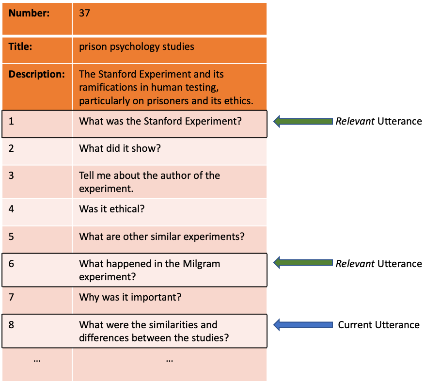

# CAsTUR
CAsTUR is a dataset consisting of relevance labels for the TREC **CAsT** 2019 **U**tterance **R**elevance.

## Introduction
CAsTUR is a set of relevance labels that we collected on conversational utterances of the TREC CAsT 2019. We aimed to identify the relevant conversational turns in a conversation as *context* of an utterance. The figure below depicts an example of a multi-turn conversation of TREC CAsT:

As we can see in this figure, the topic title, description, as well as conversation utterances are provided by the TREC CAsT organizers. What we offer in CAsTUR are the utterance relevance labels. In this example, the eighth utterance is the current conversation utterance. In order to understand the user's intent completely, we need additional information from the first and the sixth utterances. 

## Collection Procedure
One way to determine the relevant context in a conversation is to track the evolution of the information need and identify salient information in the conversation such that the current utterance is enhanced to express user's information needs more accurately. 

We hired three human annotators and instructed them to annotate relevant conversation turns. We gave them an utterance in a conversation, together with all the previous utterances. Their task was to select all the turns which could express better the information need presented in the current turn of the conversation. We asked three human expert annotators to select one or more utterances in a conversation. After independent labeling, we computed the percentage of agreement among the annotators. If the agreement score was greater than or equal to 66.67% (i.e., at least two of the three annotators agreed on the same set of relevant utterances), we recorded the relatedness label. For turns that had an agreement score below 66.67%, the three annotators deliberated and agreed on the relevance of the corresponding utterances. From the 748 utterances, 625 were annotated without any significant disagreements. A rigorous discussion between the annotators resolved the remaining 123 annotations. This procedure was conducted for both the training and evaluation sets. For more information and analysis of the data, please refer to [1].

## Files
We publish CAsTUR in one file, called `CAsTUR.tsv`. As the name suggests, the file format is TSV. `CAsTUR.tsv` only contains the official IDs of utterances in the TREC CAsT repository. For further information and access to the full data, please visit the [TREC CAsT official page](http://treccast.ai) and [GitHub repository](https://github.com/daltonj/treccastweb/tree/master/2019/data).

## File Format
### `CAsTUR.tsv`
`CAsTUR.tsv` includes the ID of an utterance, as well as the utterances that it depends on. 

**Note:** Each row of the data contains only one pair. In cases that an utterance has multiple relevant turns, they are indicated in different rows.

**Note:** In cases that an utterance is self-contained, i.e., the ones that have no relevant turns, its relevant turn is marked by `x`. 

Below we list the columns of the data and describe them:
* `current_turn`: the ID of the current turn;
* `relevant_turn`: the ID of a turn in the conversation history that `current_turn` depends on -- it is annotated relevant to `current_turn`. If `current_turn` has no relevant turns, `current_turn` equals to `x`.

Below we can see some example rows of the data, describing the example in the figure above:

current_turn | relevant_turn
-------------| -----
37_8			| 37_1
37_8 			| 37_6
10_3 			| x
...				| ...

We see in the example, that the utterance with ID `37_8` has two relevant turns in the conversation, namely, `37_1` and `37_6`. Also, we see that the utterance with ID `10_3` has no relevant turns (`x`), so it is a self-contained utterance.

## Citation

Please consider citing the following paper if you use CAsTUR in your research:

	@inproceedings{AliannejadiChiir20,
	    author    = {Aliannejadi, Mohammad and Chakraborty, Manajit and R\'issola, Esteban Andr\'es and Crestani, Fabio},
	    title     = {Harnessing Evolution of Multi-Turn Conversations for Effective Answer Retrieval},
	    booktitle = {Proceedings of 2020 Conference on Human Information Interaction and Retrieval (CHIIR)},
	    series    = {{CHIIR '20}},
	    location  = {Vancouver, British Columbia, Canada},          
	    year      = {2020}
  	}
  	
## Acknowledgments

Thanks to Mohammad Aliannejadi, Manajit Chakraborty, Esteban Andrés Ríssola, and Fabio Crestani for their invaluable contributions to this work. Also, we would like to thank the expert annotators who patiently annotated the data.  
  
## References

[1] M. Aliannejadi, M. Chakraborty, E. A. Ríssola, and F. Crestani "Harnessing Evolution of Multi-Turn Conversations for Effective Answer Retrieval", In proceedings of 2020 Conference on Human Information Interaction and Retrieval (CHIIR '20), Vancouver, British Columbia, 2020.
